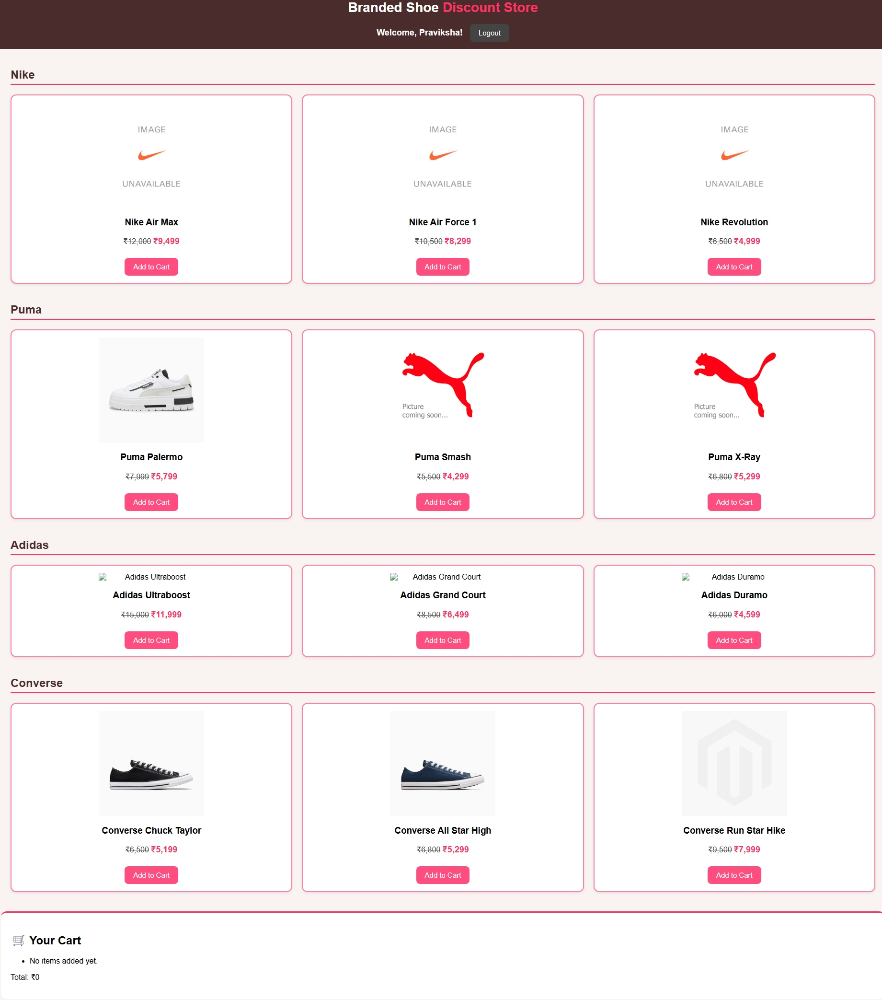
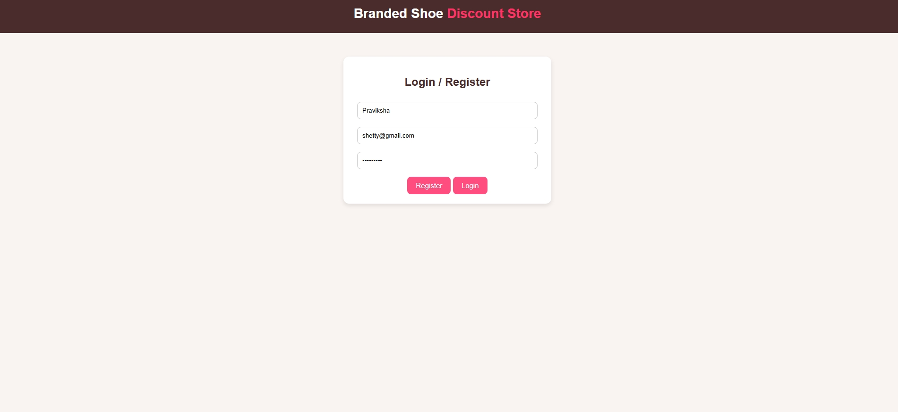
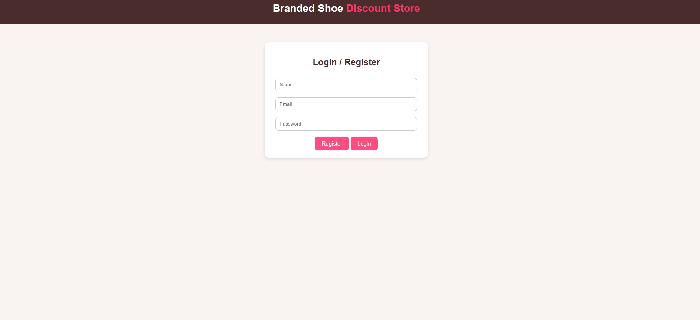
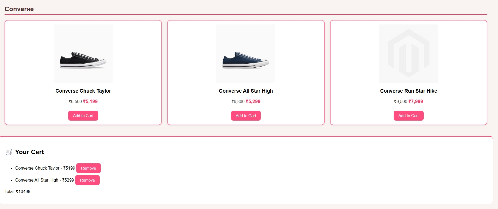

# 👟 Branded Shoe Discount Store

A modern e-commerce web application for branded shoes with user authentication, shopping cart functionality, and attractive discounts from top brands like Nike, Adidas, Puma, and Converse.

## ✨ Features

- **User Authentication**: Register and login system
- **Multi-Brand Catalog**: Nike, Adidas, Puma, and Converse shoes
- **Shopping Cart**: Add/remove items with real-time total calculation
- **Responsive Design**: Mobile-friendly interface
- **Discount Pricing**: Special discounted prices on all products
- **Express.js Backend**: RESTful API for product management

## 🛠️ Tech Stack

- **Frontend**: HTML5, CSS3, JavaScript (Vanilla)
- **Backend**: Node.js, Express.js
- **Styling**: Custom CSS with modern design
- **CORS**: Cross-origin resource sharing enabled

## 📸 Screenshots

### Home Page

*Browse through our collection of branded shoes with attractive discounts*

### User Registration

*Simple and secure user registration process*

### User Login

*Quick login to access your personalized shopping experience*

### Shopping Cart

*Manage your selected items with easy add/remove functionality*

## 🚀 Getting Started


### Installation

1. **Clone the repository**
   ```bash
   git clone <repository-url>
   cd e_com
   ```

2. **Install dependencies**
   ```bash
   npm install
   ```

3. **Start the server**
   ```bash
   npm start
   ```

4. **Open the application**
   - Backend API: `http://localhost:5000`
   - Frontend: Open `shoe.html` in your browser

## 📁 Project Structure

```
e_com/
├── Screenshots/           # Application screenshots
│   ├── cart.jpeg
│   ├── home.jpeg
│   ├── login.jpeg
│   └── Register.jpeg
├── server.js            # Express.js backend server
├── shoe.html            # Main frontend application
├── package.json         # Project dependencies
└── README.md           # Project documentation
```

## 🔧 API Endpoints

### Products
- `GET /api/products` - Fetch all available products
- `POST /api/cart` - Add product to cart

### Example API Response
```json
{
  "id": 1,
  "name": "Nike Air Max",
  "brand": "Nike",
  "oldPrice": 8999,
  "newPrice": 4999,
  "image": "https://example.com/image.png"
}
```

## 🎯 Features in Detail

### User Authentication
- Registration with name, email, and password
- Login validation
- Session management
- Logout functionality

### Product Catalog
- **Nike**: Air Max, Air Force 1, Revolution
- **Adidas**: Ultraboost, Grand Court, Duramo
- **Puma**: Palermo, Smash, X-Ray
- **Converse**: Chuck Taylor, All Star High, Run Star Hike

### Shopping Cart
- Add items to cart
- Remove items from cart
- Real-time total calculation
- Persistent cart during session

## 🎨 Design Features

- Modern pink and brown color scheme
- Hover effects on product cards
- Responsive grid layout
- Clean and intuitive user interface
- Mobile-friendly design

## 🔮 Future Enhancements

- [ ] Database integration (MongoDB/PostgreSQL)
- [ ] Payment gateway integration
- [ ] User profile management
- [ ] Order history
- [ ] Product search and filtering
- [ ] Wishlist functionality
- [ ] Admin panel for product management

## 🤝 Contributing

1. Fork the project
2. Create your feature branch (`git checkout -b feature/AmazingFeature`)
3. Commit your changes (`git commit -m 'Add some AmazingFeature'`)
4. Push to the branch (`git push origin feature/AmazingFeature`)
5. Open a Pull Request

## 📝 License

This project is licensed under the MIT License - see the [LICENSE](LICENSE) file for details.

## 👨‍💻 Author

**PRAVIKSHA R SHETTY**

## 🙏 Acknowledgments

- Product images from official brand websites
- Modern CSS design patterns
- Express.js community for excellent documentation

---

⭐ **Star this repository if you found it helpful!**

